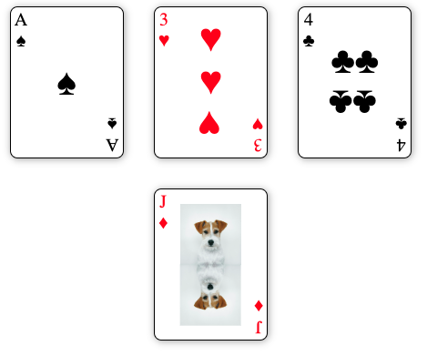

# freeCodeCamp CSS Certification Project #1

This is my submission for the first CSS certification project on freecodecamp.org. This project is part of the Responsive Web Design Certification, which in itself is also a section of the Certified Full Stack Developer Curriculum. I have listed the link to the project prompt, project instructions, and user stories that must be included in the project.

https://www.freecodecamp.org/learn/responsive-web-design-v9/lab-page-of-playing-cards/build-a-page-of-playing-cards

 

Build an app that is functionally similar to this example project [available at project link]. Try not to copy the example project, give it your own personal style.

User Stories:

1. You should build a webpage that displays at least three playing cards.

2. You should have a main element with an ID of playing-cards.

3. Within your #playing-cards element, you should have at least three div elements, each with a class of card.

4. Within each .card element, you should have three div elements, the first with a class of left, the second with a class of middle, and the third with a class of right.

5. Your #playing-cards element should use flexbox to horizontally center its children, allow them to wrap, and put a 20px space between them.

6. Each of your .card elements should use flexbox to justify its children using space-between.

7. Each of your .left elements should use flexbox item properties to align itself at the start of its' parent container.

8. Each of your .middle elements should use flexbox item properties to align itself in the center of its' parent container.

9. Each of your .right elements should use flexbox item properties to align itself at the end of its parent container.

10. Each of your .middle elements should use flexbox to display its children in a column.

